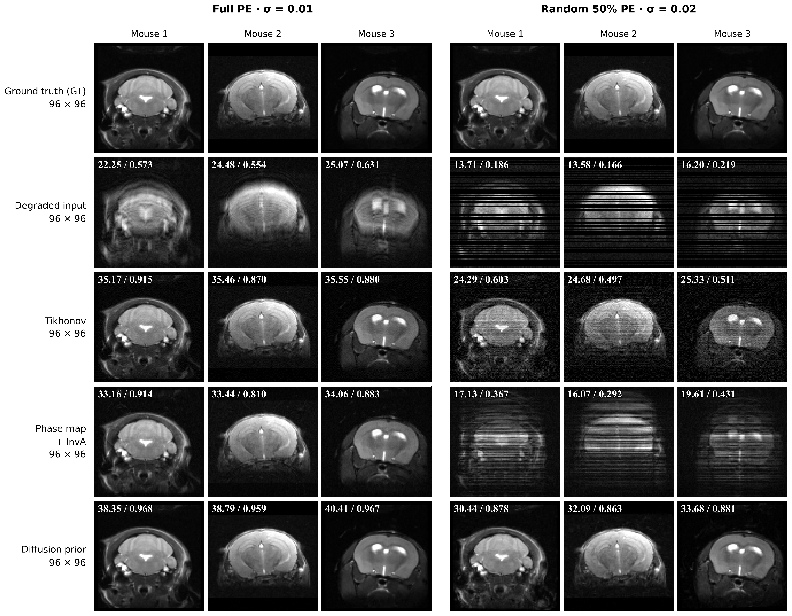
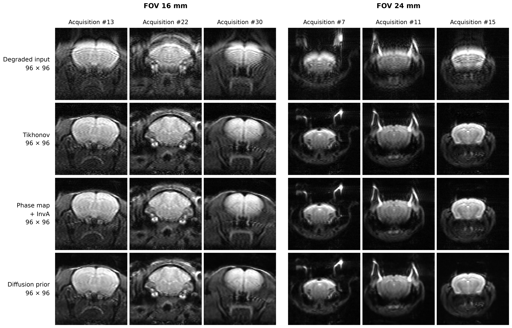

# SPEN96 重训与重建对照 · 260916

保存于 2026 年 9 月 16 日。使用本仓库重新训练的 96×96 扩散先验，复现原实验的仿真结果，并重建 6 个真实采集案例。

| 文件 | 内容 |
| --- | --- |
| [figure1_simulation.png](figure1_simulation.png) | 三例小鼠仿真；左侧完整 PE，右侧随机 50% PE |
| [figure2_real.png](figure2_real.png) | 真实采集；FOV 16 mm 和 24 mm 各三例 |
| [provenance.json](provenance.json) | 原图路径、SHA256、权重、脚本、数据及运行记录来源 |

两张图均为 300 DPI PNG，所有行均为原生 96×96。仿真图从上到下为 GT、Degraded input、Tikhonov、Phase map + InvA、Diffusion prior；真实数据图省略 GT。Phase map + InvA 固定在倒数第二行，Diffusion 在最后一行。

## 仿真



FOV 16 mm，每种条件评估 15 只留出小鼠、30 张图，个体内平均后再对个体等权平均。图中展示保存数组的第 3、8、17 号案例（从零计数），左上角为对应单图的 PSNR / SSIM。

| 条件 | 原实验 Diffusion PSNR / SSIM | 本次重训 Diffusion PSNR / SSIM |
| --- | --- | --- |
| 完整 PE，σ=0.01 | 39.1161 / 0.961441 | 39.1366 / 0.961761 |
| 随机 50% PE，σ=0.02 | 32.4232 / 0.878240 | 32.4330 / 0.878927 |

原复数观测、测试个体和验证集选定的参数保持一致，DiffPIR 为 60 步、随机种子 72。输入 RSS 与 Phase map + InvA 使用相同观测上的归档基线；Tikhonov 与重训 Diffusion 为本次推理。指标使用固定 [0,1] 范围，全图 PSNR 与高斯窗口 SSIM（σ=1.5，边缘裁去 5 像素）。

逐例指标、选定参数和重建数组见本地 [evaluation/](../../code/spen_diffusion_recons/runs/retrain_0911_260916/evaluation/)。

## 真实采集



| 视野 | MAT 扫描目录 | 导出编号 |
| --- | --- | --- |
| FOV 16 mm | `20240321_lxj_spen_mouse_240321_1_1_1` | 13、22、30 |
| FOV 24 mm | `20240115_lxj_SPEN_96_240115_1_1_1` | 7、11、15 |

数据位于 [code/data/spen_acquired_260915/mat/](../../code/data/spen_acquired_260915/mat/)。使用原 MAT 相位校正结果及传统重建估计的线圈/相位，所有方法共用幅度标尺和 [0,1] 显示窗，显示时统一旋转 180°。Tikhonov 为 ρ=0.003；DiffPIR 为 60 步、λ=1、σ=0.02、随机种子 73。

真实数据没有配对干净真值，不计算 PSNR/SSIM。逐例来源、测量残差和重建数组见本地 [evaluation_real/](../../code/spen_diffusion_recons/runs/retrain_0911_260916/evaluation_real/)。六例重新生成的观测与原实验观测最大差值均为 0。

## 训练、权重与数据

训练从随机初始化开始：8,413 张大鼠训练图预训练 5,000 步，再以小鼠/大鼠 80%/20% 比例在 18,037 张混合训练图上训练 30,000 步。单 GPU 微批量 24、梯度累积 4 次，有效批量 96。沿用原数据划分；旧 V1 权重仅用于验证基准，不初始化新训练。

- 训练入口：[train_pipeline.py](../../code/spen_diffusion_recons/scripts/prior96/train_pipeline.py)，训练循环：[train_strong.py](../../code/spen_diffusion_recons/scripts/prior96/train_strong.py)。
- 输入与来源：[数据说明](../../code/data/prior96_0911_260916/README_260916.md)、[provenance.json](../../code/data/prior96_0911_260916/provenance.json)。数据通过符号链接接入旧项目。
- 权重：[mouse_mixed/model_ema.pt](../../code/spen_diffusion_recons/runs/retrain_0911_260916/mouse_mixed/model_ema.pt)，第 30,000 步 EMA。
- 运行记录：[retrain_0911_260916/](../../code/spen_diffusion_recons/runs/retrain_0911_260916/)。
- 重建入口：[evaluate_reconstruction.py](../../code/spen_diffusion_recons/scripts/prior96/evaluate_reconstruction.py)，通过 `--mode simulation` 或 `--mode real` 选择数据类型。

权重 SHA256：

```text
f88e07af8087948abc3f6ceb53284f0984d52846a24c2f93afccc76cdcf9939e
```

## 重新绘图

绘图入口为 [render_comparison.py](../../code/spen_diffusion_recons/scripts/prior96/render_comparison.py)。在 `code/spen_diffusion_recons/` 下，使用安装了 NumPy、Matplotlib 及 Times New Roman Bold 字体的环境运行，无需 GPU：

```bash
python scripts/prior96/render_comparison.py --run runs/retrain_0911_260916/evaluation --kind simulation
python scripts/prior96/render_comparison.py --run runs/retrain_0911_260916/evaluation_real --kind real
```

以上命令更新 `runs/` 下的 PNG/PDF；本目录保存此次确认的 PNG 副本，不会自动更新。权重、原始数据、NPZ 数组、PDF 和完整日志保留在原运行目录。
