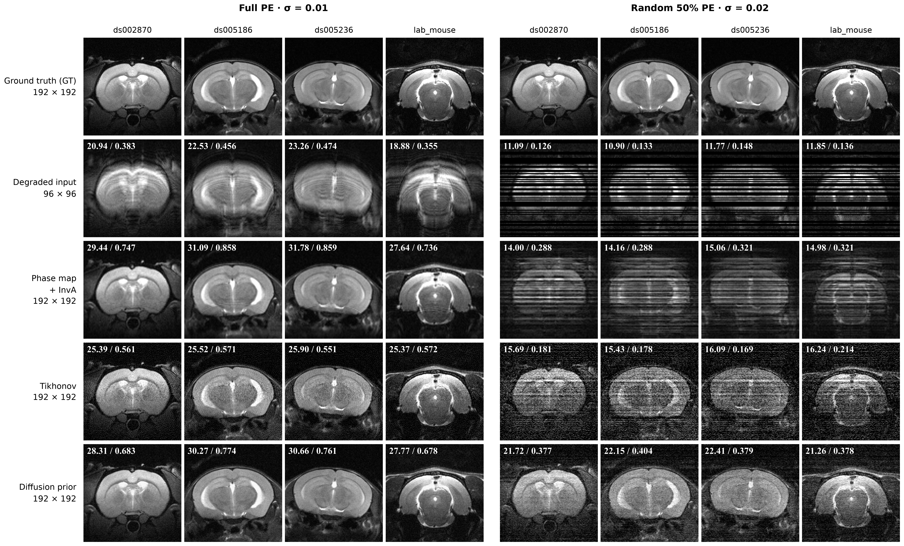
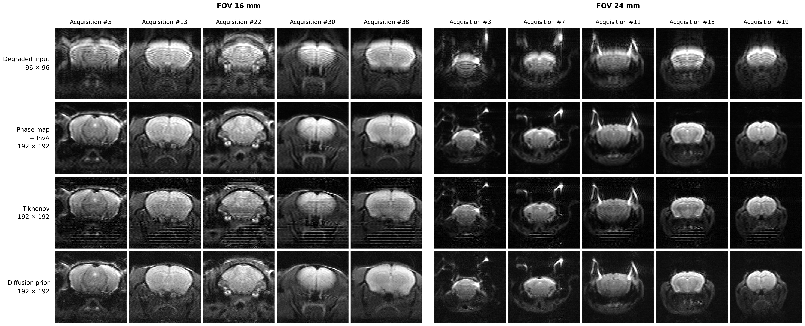

# SPEN 重建对照 · 260915

保存于 2026 年 9 月 15 日，对应实验 `rodent192_spen2x_260914`。本目录保存确认后的仿真与真实采集对照图，比较 PhaseMap + InvA、Tikhonov 和扩散先验重建。采集网格为 96×96，重建展示网格为 192×192。

## 文件

| 文件 | 内容 |
| --- | --- |
| [figure1_simulation.png](figure1_simulation.png) | 四例仿真，左右比较完整 PE 与更高噪声下的随机 50% PE |
| [figure2_real.png](figure2_real.png) | 真实采集数据，FOV 16 mm 和 24 mm 各五例 |

两张图均为 300 DPI PNG。底层数组、重建参数及数值诊断保存在本地 `code/spen_diffusion_recons/runs/rodent192_spen2x_260914/figures_260915/`（路径相对工作区根目录，下文简称图像运行目录）。

Git 仓库收录本目录的两张 PNG、本文和相关源码。`runs/`、权重、NPZ 数组及原始 MAT 受现有 `.gitignore` 规则排除；重新绘图或重建需要本地保留相应文件。

## 图 1：仿真结果



从上到下依次为：

1. **Ground truth (GT)**：192×192 参考图像。
2. **Degraded input**：96×96 退化观测的多线圈幅度合成图（RSS）。
3. **Phase map + InvA**：相位校正后，使用扫描流程中的加权 InvA 矩阵重建。
4. **Tikhonov**：带二次正则项的传统重建。
5. **Diffusion prior**：最终扩散先验权重配合 DiffPIR 重建。

左右使用相同四例图像，来源为 `ds002870`、`ds005186`、`ds005236` 和 `lab_mouse`。192×192 图像通过 SPEN 前向算子生成 96×96 观测，仿真采用 16 mm 视野的编码几何和合成线圈。

| 设置 | 左侧：Full PE | 右侧：Random 50% PE |
| --- | --- | --- |
| PE（相位编码）采样 | 完整 96 条 | 随机保留 48/96 条 |
| 复高斯噪声 σ | 0.01 | 0.02 |
| Tikhonov 正则参数 ρ | 0.0001 | 0.0003 |
| DiffPIR 参数 λ | 1 | 0.3 |

σ 分别指噪声实部、虚部的标准差。50% 掩码作用于整条 PE 线，同步用于全部读出点和接收通道；缺失行补零。掩码种子为 `20260914`，左右共用底层噪声实现并按各自 σ 缩放。仿真未额外注入奇偶行相位误差。

### 分辨率、显示与指标

- 所有图块显示大小一致，输入数组仍为 96×96，以最近邻方式放大显示。PhaseMap + InvA 先在 96×96 网格重建，再用双三次插值放大至 192×192；Tikhonov 和 Diffusion 直接在 192×192 网格重建。
- 各图块使用固定 `[0,1]` 灰度窗；输入采用单位物体响应标定，左右共用标定系数。
- 输入及三种重建的左上角标注 **PSNR / SSIM**：白色、加粗 Times New Roman，PSNR 单位为 dB、保留两位小数，SSIM 保留三位小数。GT 不计算或标注指标。
- 指标计算前将预测与 GT 裁剪至 `[0,1]`。输入先最近邻插值至 192×192，再与 GT 比较。PSNR 使用全图均方误差；SSIM 使用高斯窗口（σ=1.5），计算均值时去除四周各 5 像素。

**结果适用范围：**展示样本与调参样本分开，参数按固定调参样本的 PSNR 选择；两组样本均参与过先验训练，因此本图展示训练集内仿真表现，不能用作独立测试集的泛化结论。固定样本详见本地图像运行目录中的 `simulation_cases.json`，参数和重建指标详见 `simulation.json`。输入行指标由绘图脚本计算。

## 图 2：真实采集结果



从上到下为 **Degraded input、Phase map + InvA、Tikhonov、Diffusion prior**。输入为 96×96，其余三行展示为 192×192，图块显示大小一致。

| 视野 | 从左到右的 MAT 导出编号 |
| --- | --- |
| FOV 16 mm | 5、13、22、30、38 |
| FOV 24 mm | 3、7、11、15、19 |

每个视野保留原三例并增加两例；编号沿用 MAT 导出编号，不代表连续体积的层号。采集文件来自本地 `code/data/spen_acquired_260915/mat/`。

相位校正使用 MAT 中保存的扫描处理结果，线圈及相位估计来自传统重建。Tikhonov 使用 `ρ=0.003`；DiffPIR 使用 `λ=1`、噪声参数 `σ=0.02`、60 步。各方法共用传统重建参考的幅度标尺与 `[0,1]` 灰度窗，显示时统一旋转 180°。

真实数据没有配对的高分辨率 GT，因此不计算 PSNR/SSIM，图中不显示 GT 提示文字。192×192 表示输出网格大小，不能据此认定真实空间分辨率已翻倍。逐例来源、参数和数值诊断详见本地图像运行目录中的 `real.json`。

## 权重与重新绘图

两张图的扩散重建使用最终 **60,000 步 EMA 权重**：本地 `code/spen_diffusion_recons/runs/rodent192_spen2x_260914/train/model_ema.pt`，DiffPIR 均为 60 步。权重 SHA256 为：

```text
38e528762fe30cc2e20437568f672c50e60a6987682709da6339a5cc305e05a9
```

绘图脚本已固化在 [render_rebuilt.py](../../code/spen_diffusion_recons/scripts/prior192/render_rebuilt.py)。使用原 run 中的 `simulation.npz` 和 `real.npz` 可重新绘图，无需加载权重或重新推理。在当前工作区执行：

```bash
cd /home/data2/chk/workspace/2026/09/14/spen_xspen/code/spen_diffusion_recons
/home/data2/chk/workspace/2026/.venv/bin/python -B scripts/prior192/render_rebuilt.py
```

仅重画一张时，在命令末尾加 `simulation` 或 `real`。命令默认覆盖原 run 下 `figures_260915/` 中的 PNG；本目录中的确认副本不会自动更新。绘图依赖 NumPy、SciPy、Matplotlib 和 Times New Roman Bold 字体。

从原始数据重新进行重建的入口为 [rebuild_figures.py](../../code/spen_diffusion_recons/scripts/prior192/rebuild_figures.py)，本地图像运行目录中的 `README.md` 保存运行说明。可用 `--help` 查看数据、权重和输出参数。
