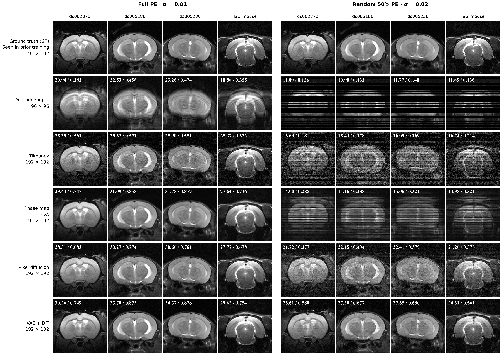
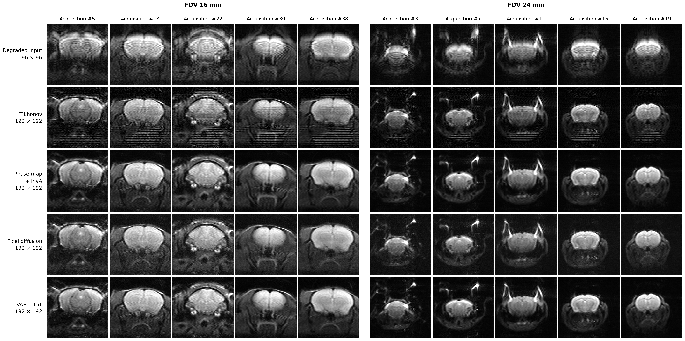

# SPEN VAE + DiT 重建对照 · 260916

保存 2026 年 9 月 16 日确认的两张重建对比图。使用冻结的预训练 VAE 和完成 60,000 步训练的 DiT EMA，重新推理 4 个仿真病例的两种采样条件，以及 10 个真实采集病例。

| 文件 | 内容 |
| --- | --- |
| [figure1_simulation.png](figure1_simulation.png) | 四例仿真；左侧完整 PE，右侧随机 50% PE |
| [figure2_real.png](figure2_real.png) | 真实采集；FOV 16 mm 和 24 mm 各五例 |
| [simulation_metrics.csv](simulation_metrics.csv) | 仿真各病例、各方法的 PSNR 和 SSIM |
| [real_measurement_metrics.csv](real_measurement_metrics.csv) | 实采各病例的测量 NRMSE |
| [provenance.json](provenance.json) | 图片、权重、脚本与输入文件的路径、SHA256，以及复测摘要 |

两张主图均为 300 DPI PNG。仿真从上到下为 GT、Degraded input、Tikhonov、Phase map + InvA、Pixel diffusion、VAE + DiT；实采省略 GT。输入为 96×96，重建输出网格为 192×192；所有方法采用同一 [0,1] 灰度窗，实采统一按原图方向旋转 180°。

Pixel diffusion 是原有的 192×192 像素空间扩散重建基线，来自 [SPEN_Reconstruction_Comparison_260915](../SPEN_Reconstruction_Comparison_260915/)。VAE + DiT 在 4×48×48 潜空间去噪，再解码并结合 SPEN 测量约束完成反演。两套流程的初始化和求解器也不同，此处比较完整重建方案。

## 仿真



四例分别来自 ds002870、ds005186、ds005236 和 lab_mouse；每个来源展示一例。图中左上角为单例 PSNR / SSIM，下表为四例算术平均。

| 方法 | 完整 PE，σ=0.01 | 随机 50% PE，σ=0.02 |
| --- | ---: | ---: |
| Degraded input | 21.401 / 0.4169 | 11.404 / 0.1360 |
| Tikhonov | 25.546 / 0.5639 | 15.864 / 0.1857 |
| Phase map + InvA | 29.988 / 0.8000 | 14.546 / 0.3047 |
| Pixel diffusion | 29.250 / 0.7242 | 21.883 / 0.3845 |
| VAE + DiT | 31.988 / 0.8137 | 26.291 / 0.6247 |

相对 Pixel diffusion，完整采样和 50% 采样的平均 PSNR 分别提高约 2.74 dB 和 4.41 dB。仿真展示与校准病例均参与过先验训练，不能据此作独立测试集泛化结论。

沿用固定观测、采样掩码和传统基线。PSNR 使用固定 [0,1] 范围；SSIM 使用高斯窗口 σ=1.5，边缘裁去 5 像素。96×96 输入计算指标时以最近邻扩展到 192×192。

## 真实采集



| 视野 | MAT 扫描目录 | 导出编号 |
| --- | --- | --- |
| 16 mm | `20240321_lxj_spen_mouse_240321_1_1_1` | 5、13、22、30、38 |
| 24 mm | `20240115_lxj_SPEN_96_240115_1_1_1` | 3、7、11、15、19 |

输入位于本地 `code/data/spen_acquired_260915/mat/`。沿用原 MAT 的相位校正结果、线圈/相位模型与幅度标尺。本轮重新生成的实采观测与此前保存的观测完全一致。

| FOV | Tikhonov | Phase map + InvA | Pixel diffusion | VAE + DiT |
| --- | ---: | ---: | ---: | ---: |
| 16 mm | 0.1149 | 0.1080 | 0.1312 | 0.1009 |
| 24 mm | 0.1260 | 0.1253 | 0.1905 | 0.1423 |

表中为平均测量 NRMSE。实采没有配对真值，不计算 PSNR/SSIM；残差更低仅表示当前前向模型下更符合观测，不能单独确定图像质量。仍可见残余条纹，192×192 输出网格也不代表实采空间分辨率已经翻倍。

## 训练、权重与复测

- VAE：冻结的 `stabilityai/stable-diffusion-x4-upscaler` 预训练 VAE；灰度图重复到三个通道，使用确定性 posterior mode 编码，解码 RGB 取均值。
- DiT：完成 60,000 步训练，使用 EMA。潜空间尺寸为 4×48×48，patch size 2，hidden size 768，12 层、12 个 attention heads。
- 训练数据：本地 `code/spen_diffusion_recons/runs/rodent192_spen2x_260914/data_all/`，共 10,633 幅原生 192×192 图像，全部用于训练，无训练阶段 holdout。
- 训练入口：[train_latent_ddp.py](../../code/spen_diffusion_recons/scripts/latent48/train_latent_ddp.py)。
- 重建入口：[review_reconstruction.py](../../code/spen_diffusion_recons/scripts/latent48/review_reconstruction.py)，调用 [evaluate_reconstruction.py](../../code/spen_diffusion_recons/scripts/latent48/evaluate_reconstruction.py) 与 [latent_reconstruction.py](../../code/spen_diffusion_recons/scripts/latent48/latent_reconstruction.py)。
- 权重：本地 `code/spen_diffusion_recons/runs/rodent192_latent_dit_260915/reconstruction_final_260916/checkpoint.pt`。
- 本轮数组、参数及日志：本地 `code/spen_diffusion_recons/runs/rodent192_latent_dit_260915/review_260916/`。
- 对照图及固定输入：本地 `code/spen_diffusion_recons/runs/rodent192_spen2x_260914/figures_260915/`。

权重 SHA256：

```text
cc98fcc3970c6313bd1578164d35f855c4378c40dece1388db67935224c5c5b3
```

复测沿用先前校准选出的 λ：完整 PE 为 0.1，随机 50% PE 为 1，实采为 0.1。60 个外层步，每步最多 8 次近端更新；编码器与 DiT 使用 BF16，解码器使用 FP32。初始化为原生 96 网格 Tikhonov（ρ=0.003），双三次放大到 192 网格后编码。

原始最终产物及 42 条优化轨迹、本轮 18 次推理的指标和轨迹均已核验。本轮与原结果的仿真单例 PSNR 最大变化为 0.0203 dB；原始 [-1,1] 数组逐例 RMSE 最大 0.014398，最大单像素差为 0.241922。平均指标接近，但并非逐像素完全一致的复现，数值差异来源尚未定位。

## 重新绘图

绘图入口为 [render_review.py](../../code/spen_diffusion_recons/scripts/latent48/render_review.py)，复用 [render_rebuilt.py](../../code/spen_diffusion_recons/scripts/prior192/render_rebuilt.py) 的布局。它从已保存的复测数组生成这两张图及指标表，无需重新推理。

在 `code/spen_diffusion_recons/` 下运行，`--out` 指向尚不存在的目录：

```bash
/home/data2/chk/workspace/2026/.venv/bin/python -B scripts/latent48/render_review.py \
  --run runs/rodent192_latent_dit_260915/review_260916 \
  --out runs/rodent192_latent_dit_260915/review_260916/redraw_260916
```

需要 NumPy、SciPy、Matplotlib、Pillow 及 Times New Roman Bold 字体。本目录保存确认的 PNG、指标表和来源说明；权重、原始数据、NPZ 与完整运行日志保留在本地。
